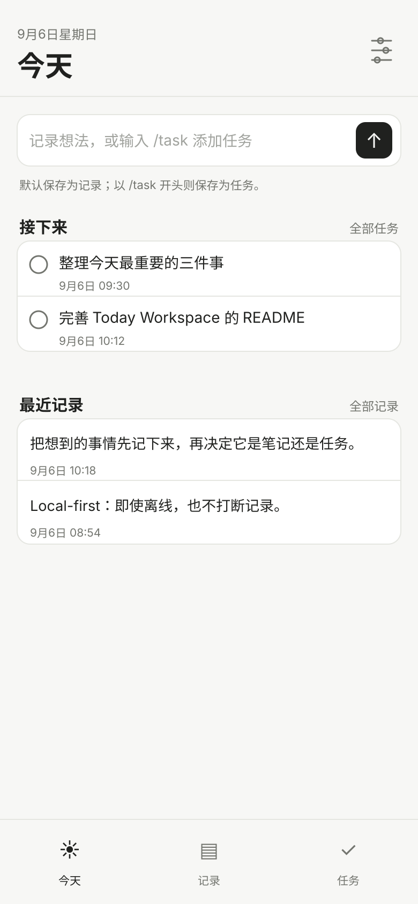
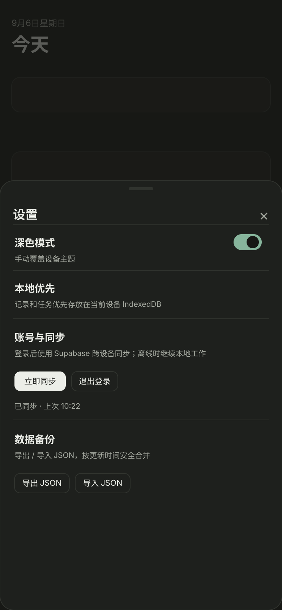

# Today Workspace

> Capture now. Organize later.

一个克制、local-first、mobile-first 的个人工作台，用尽可能低的摩擦记录想法和任务。Today Workspace 同一套前端同时运行于 Web / PWA 与 Android：本地数据优先写入 IndexedDB，登录后通过 Supabase 跨设备同步。

[](https://github.com/chivopic/today-workspace/actions/workflows/today-workspace-android.yml)
[](https://today-workspace.vercel.app)
[](./RELEASE.md)
[](#local-first)

**在线体验：** https://today-workspace.vercel.app

项目最初在 `chivopic/my-software` 中孵化，并于 2026-09-06 独立为长期维护仓库。迁移前的提交历史仍保留在原仓库中。

## 界面预览

<p align="center">
  
  &nbsp;&nbsp;
  
</p>

<p align="center"><sub>示例内容仅用于展示；预览按当前项目的布局与视觉样式绘制。</sub></p>

## 为什么做它

很多笔记和任务工具要求先决定“这是什么、放到哪里、怎么分类”，而 Today Workspace 的思路更简单：**先记下来，再整理。**

- 普通文本直接成为记录
- 输入 `/task ...` 直接成为任务
- 没网也能继续使用
- 登录后再负责同步，而不是让网络状态阻塞输入
- Web / PWA / Android 共用一套产品逻辑

## 核心能力

| 能力 | 当前实现 |
| --- | --- |
| 快速记录 | 首页直接捕获想法；`/task` 快速创建任务 |
| 记录 | 搜索、编辑、删除 |
| 任务 | 创建、完成、删除、状态筛选 |
| Local-first | IndexedDB 本地持久化，写入不等待网络 |
| 云同步 | Supabase Auth + Notes / Tasks 双向同步 |
| 离线队列 | 本地 `outbox` 保存待同步修改 |
| 删除同步 | tombstone 软删除，保留跨设备删除语义 |
| 数据备份 | JSON v2 导出 / 导入，并兼容旧 v1 备份 |
| PWA | Vite PWA + Workbox 离线缓存与安装图标 |
| Android | Capacitor 8，应用 ID `io.chivopic.today` |
| Release | GitHub Actions 构建 debug APK 与签名 APK / AAB |
| 外观 | 浅色 / 深色模式，移动端优先布局 |

## 技术栈

- **Frontend:** Vanilla JavaScript + HTML + CSS
- **Build:** Vite 8
- **PWA:** `vite-plugin-pwa` + Workbox
- **Local data:** IndexedDB
- **Cloud:** Supabase Auth + Database
- **Android:** Capacitor 8
- **CI / Release:** GitHub Actions, JDK 21, Android SDK 36
- **Hosting:** Vercel

## Local-first

Today Workspace 把“本地可用”当作默认状态，而不是降级模式。

```text
User action
    │
    ▼
IndexedDB ───────────────► UI immediately updates
    │
    ├── notes / tasks
    │
    └── outbox
          │
          ▼ when online + signed in
       Supabase
          │
          ▼
      other devices
```

每次新建、编辑、完成任务或删除时，实体更新与 outbox 入队在同一个 IndexedDB transaction 中完成。删除使用 `deletedAt` tombstone；同步成功后再清理对应 outbox 项。

当前数据库沿用历史 key `test1-workspace`，避免升级后已有设备上的本地数据“消失”。Schema v2 包含：

```text
notes
  id / text / createdAt / updatedAt
  userId / deviceId / version / deletedAt / syncStatus

tasks
  id / text / done / createdAt / updatedAt
  userId / deviceId / version / deletedAt / syncStatus

outbox
  id / store / entityId / operation / record / deviceId / queuedAt
```

## 工程结构

```text
index.html          页面结构
main.js             Vite 入口
app.js              业务逻辑、IndexedDB 数据层、本地同步队列
cloud.js            Supabase Auth 与云同步
icons.js            本地图标运行时
styles.css          主界面样式
cloud.css           账号与同步样式
public/             PWA / Android 共用静态图标
scripts/            Android release 辅助脚本
vite.config.js      Web / PWA 构建配置
capacitor.config.json
```

## 本地开发

Capacitor 8 要求 Node.js 22 或更高版本。

```bash
npm install
npm run dev
```

生产构建：

```bash
npm run build
npm run preview
```

构建产物位于 `dist/`，Vercel 与 Capacitor 都使用这份 Web bundle。

## Android

首次创建 Android 工程：

```bash
npm install
npm run build
npm run android:add
```

后续同步 Web bundle：

```bash
npm run android:sync
```

使用 Android Studio 打开：

```bash
npm run android:open
```

GitHub Actions 会在 `main` 更新与相关 PR 中构建 debug APK。正式发布流程可手动构建签名 APK / AAB，并执行签名验证和 SHA-256 校验。详细说明见 [`RELEASE.md`](./RELEASE.md)。

## 部署

项目已经是独立仓库，Vercel 应直接以仓库根目录作为 Root Directory：

```text
Repository: chivopic/today-workspace
Branch:     main
Root:       ./
```

## Roadmap

- [ ] 增量 pull / cursor
- [ ] 更明确的多设备冲突策略
- [ ] 同步失败重试与状态可视化
- [ ] 任务日期与提醒
- [ ] 系统分享入口等原生能力
- [ ] 更完整的自动化测试
- [ ] 正式 Android 版本发布与 changelog

---

Today Workspace is intentionally small: fast to open, easy to understand, and dependable when the network is not.